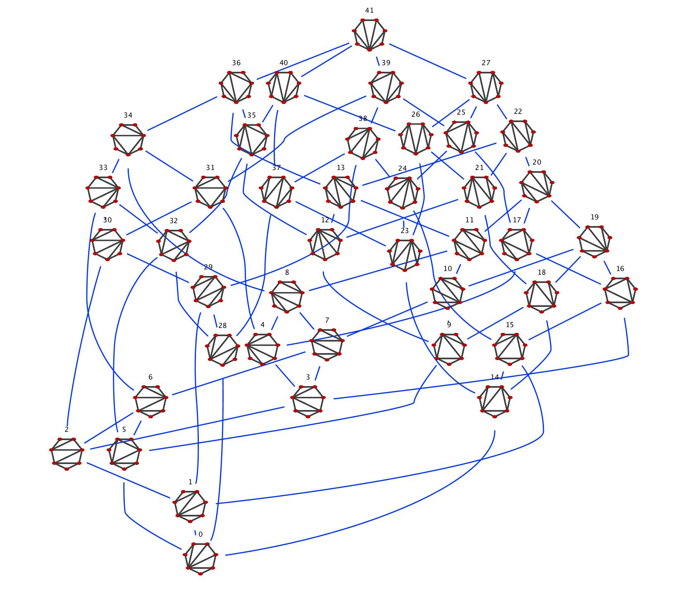

fgg
===

Flip Graph Generator for a Convex Polygon

Description
---
fgg is for generating flip graphs of convex n-gons. The following
image is a flip graph of the regular heptagon.  Each vertex is drawn
with a triangulation of the heptagon. Two vertices are connected by
an edge (blue line), if they are transformed from a flip operation.
fgg library is implemented by C++, and provides procedures for
preparing some stuffs used in the following image.

We have confirmed that fgg generates topological structures of
flip graphs correctly up to 15-gon.

Required Library
---
Since fgg uses
[the igraph library](http://igraph.sourceforge.net/ "the igraph library"),
user has to install it.  However, we consider other graph library, too.
We may exchange graph library at some future dates, because igraph
library is not so fast for creating a large graph structure.

Compile &amp; Install
---
We confirm fgg well-behaved at least on Mac 10.5.8, g++ 4.0.1, and
igraph 0.6.5. If you could not compile fgg library, please
let me know on your issue.

	$ cmake .
	$ make
	$ make install [optional]

How to use fgg
---
We wrote simple examples in example directory. Documentation and
comments of each function are now preparing.

Thank you!!
===

